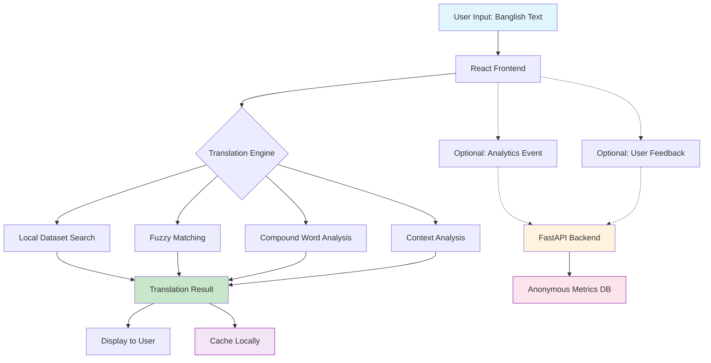
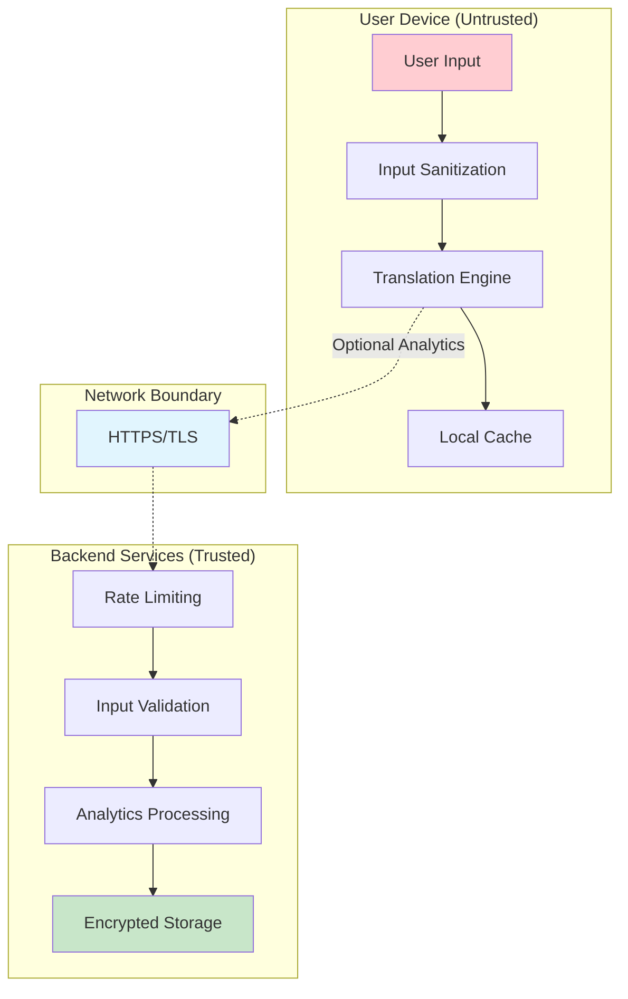
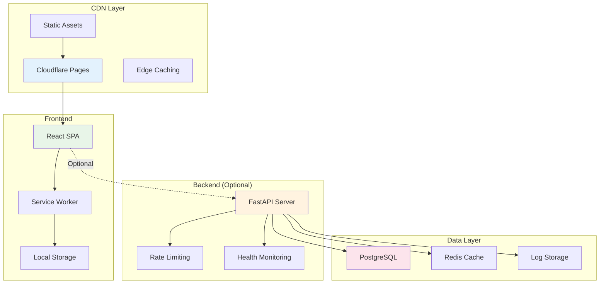
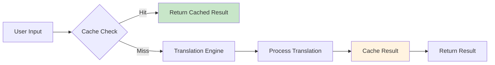
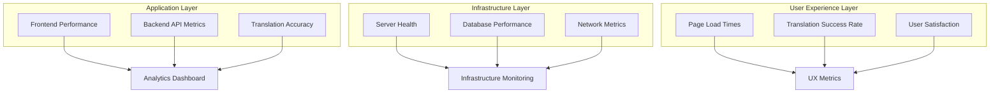
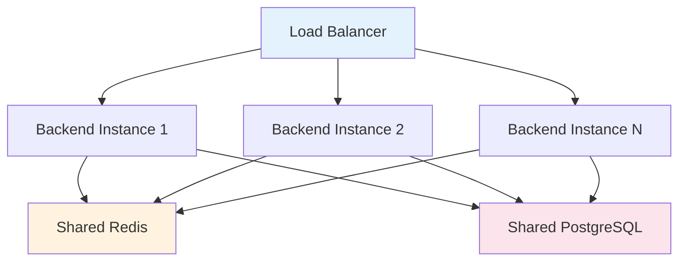

# DHK Align – Architecture Overview

*Last Updated: August 2025*

## 🏗️ High-Level Design

DHK Align follows a **privacy-first, client-side architecture** where the core translation functionality runs entirely in the user's browser, with an optional backend for analytics and feedback collection.

### Core Components

- **Frontend (React PWA)**
  - Runs 100% client-side translation processing
  - Contains complete translation engine (JavaScript) + curated dataset
  - Offline-first with local cache and user preferences
  - Communicates with backend only for optional analytics/feedback
  - Self-contained: works without any server dependency

- **Backend (FastAPI, Optional)**
  - Lightweight, stateless API service
  - Endpoints: `/health`, `/feedback`, `/analytics`; `/translate` **disabled by default** (emergency/private only)
  - **Never processes translation content** in normal operation
  - Can be deployed privately, publicly, or not at all
  - Purely supplementary to the frontend experience

- **Backend-Private (Internal)**
  - Complete implementation with admin tools
  - Internal documentation and deployment scripts
  - Not deployed publicly, contains proprietary algorithms
  - Used for development, testing, and internal operations

- **Documentation**
  - Public policies: `PRIVACY.md`, `SECURITY.md`, `CONTRIBUTING.md`
  - Architecture documentation: `docs/ARCHITECTURE.md`
  - API documentation: Auto-generated with FastAPI

## 🔀 Data Flow



### Key Data Flow Principles

- **Translations**: Stay entirely in frontend + local storage
- **Feedback/Analytics**: Optional, anonymized, sent to backend
- **No raw text**: Backend only ever stores metadata and statistics
- **Offline-first**: Core functionality works without internet
- **Progressive enhancement**: Backend adds features but isn't required

## 🧩 Detailed Component Architecture

### Frontend Architecture

```
frontend/
├── src/
│   ├── components/           # React UI components
│   │   ├── Translator.jsx    # Main translation interface
│   │   ├── ResultDisplay.jsx # Translation results
│   │   ├── ConfidenceBar.jsx # Confidence indicator
│   │   └── FeedbackForm.jsx  # Optional feedback collection
│   ├── utils/               # Core translation logic
│   │   ├── translation-engine.js      # 🔐 Main engine
│   │   ├── dhk_align_data_client.json # 🔐 Translation dataset
│   │   ├── cache.js         # LRU caching system
│   │   ├── sanitizer.js     # Input sanitization
│   │   └── logger.js        # Client-side logging
│   ├── hooks/               # React hooks
│   │   ├── useTranslation.js # Translation hook
│   │   ├── useCache.js      # Cache management
│   │   └── useAnalytics.js  # Optional analytics
│   ├── api/                 # Backend communication
│   │   ├── client.js        # API client wrapper
│   │   ├── analytics.js     # Analytics endpoints
│   │   └── feedback.js      # Feedback endpoints
│   └── App.js               # Main application
└── public/
    ├── manifest.json         # PWA configuration
    ├── sw.js                # Service worker
    └── index.html           # Entry point
```

### Translation Engine Detail

```javascript
// Simplified engine architecture
class TranslationEngine {
  constructor() {
    this.exact_translations = new Map();     // Direct phrase matches
    this.slang_mappings = new Map();         // Slang variations
    this.compound_rules = [];                // Word combination rules
    this.phonetic_index = new Map();         // Sound-alike mappings
    this.cache = new LRUCache(100);          // Performance cache
  }

  // 8-layer fallback system
  translate(input) {
    return this.exactMatch(input) ||
           this.slangMatch(input) ||
           this.fuzzyMatch(input) ||
           this.compoundMatch(input) ||
           this.patternMatch(input) ||
           this.ngramMatch(input) ||
           this.contextualMatch(input) ||
           this.wordByWordMatch(input);
  }
}
```

### Backend Architecture

```
backend/
├── app/
│   ├── api/                 # API endpoints
│   │   ├── analytics.py     # Anonymous usage analytics
│   │   ├── feedback.py      # User feedback collection
│   │   ├── health.py        # Health monitoring
│   │   └── translate.py     # Fallback translation (emergency)
│   ├── core/               # Core functionality
│   │   ├── config.py       # Configuration management
│   │   ├── logging.py      # Structured logging
│   │   └── security.py     # Security utilities
│   ├── models/             # Data models
│   │   ├── analytics.py    # Analytics data structures
│   │   └── feedback.py     # Feedback data structures
│   └── utils/              # Utility functions
│       ├── rate_limiter.py # Rate limiting
│       └── validator.py    # Input validation
├── logs/                   # Structured logs
│   ├── analytics.jsonl     # Usage analytics
│   ├── feedback.jsonl      # User feedback
│   └── errors.log         # Error logs
└── main.py                 # FastAPI application
```

## 🔐 Trust Boundaries & Security Model

### Trust Zones

| Zone | Trust Level | Data Handling | Security Measures |
|------|-------------|---------------|-------------------|
| **User Browser** | Untrusted | User input, local processing | Input sanitization, CSP headers |
| **Frontend Engine** | Trusted code, untrusted input | Translation processing | Validation, encoding, sandboxing |
| **Backend API** | Trusted service | Metadata only | Authentication, rate limiting, validation |
| **Database/Logs** | Trusted storage | Anonymous metrics | Encryption at rest, access controls |

### Security Boundaries



### Data Classification

| Data Type | Sensitivity | Storage Location | Retention |
|-----------|-------------|------------------|-----------|
| **Translation Content** | High | Browser only (never transmitted) | Session only |
| **User Preferences** | Low | Browser localStorage | User controlled |
| **Usage Analytics** | Low | Backend (anonymous) | 90 days |
| **Feedback Data** | Medium | Backend (sanitized) | 5 years |
| **Error Logs** | Low | Backend | 30 days |

## 🚀 Deployment Architecture

### Production Deployment Model



### Deployment Options

#### Option 1: Frontend Only (Recommended)
```bash
# Build and deploy frontend
cd frontend
npm run build
# Deploy to Cloudflare Pages, Netlify, or Vercel
```

**Pros**: Maximum privacy, zero server costs, offline-capable  
**Cons**: No analytics, no feedback collection

#### Option 2: Frontend + Public Backend
```bash
# Frontend deployment
cd frontend && npm run build

# Backend deployment  
cd backend && docker build -t dhkalign-backend .
# Deploy to Railway, Heroku, or DigitalOcean
```

**Pros**: Analytics insights, user feedback, fallback translation  
**Cons**: Server costs, complexity, potential privacy concerns

#### Option 3: Frontend + Private Backend
```bash
# Frontend: Public deployment
# Backend: Private server or VPN-only access
```

**Pros**: Complete feature set, maximum control  
**Cons**: Infrastructure complexity, maintenance overhead

### Infrastructure as Code

```yaml
# docker-compose.yml (Production)
version: '3.8'
services:
  backend:
    image: dhkalign/backend:latest
    environment:
      - DATABASE_URL=${DATABASE_URL}
      - REDIS_URL=${REDIS_URL}
    healthcheck:
      test: ["CMD", "curl", "-f", "http://localhost:8000/health"]
      interval: 30s
      timeout: 10s
      retries: 3
    
  redis:
    image: redis:7-alpine
    command: redis-server --requirepass ${REDIS_PASSWORD}
    
  postgres:
    image: postgres:15
    environment:
      - POSTGRES_DB=dhkalign
      - POSTGRES_PASSWORD=${DB_PASSWORD}
    volumes:
      - postgres_data:/var/lib/postgresql/data
```

## 📊 Performance Architecture

### Performance Characteristics

| Component | Target | Measurement | Optimization Strategy |
|-----------|--------|-------------|----------------------|
| **Translation Speed** | <50ms | Client-side timing | LRU cache, optimized algorithms |
| **First Load** | <2s | Lighthouse | Code splitting, compression |
| **Bundle Size** | <200KB | Webpack analyzer | Tree shaking, dynamic imports |
| **Cache Hit Rate** | >85% | Analytics | Smart caching strategies |
| **Offline Capability** | 100% | Manual testing | Service worker, local storage |

### Caching Strategy



### Optimization Techniques

1. **Frontend Optimizations**
   - Lazy loading of non-critical components
   - Service worker for offline caching
   - Debounced input for real-time translation
   - LRU cache for recent translations

2. **Backend Optimizations**
   - Redis caching for frequent queries
   - Database connection pooling
   - Async request processing
   - Rate limiting to prevent abuse

## 🔍 Monitoring & Observability

### Monitoring Stack



### Key Metrics

| Category | Metric | Target | Alert Threshold |
|----------|--------|--------|-----------------|
| **Performance** | Translation latency | <50ms | >100ms |
| **Reliability** | Success rate | >99% | <95% |
| **User Experience** | Page load time | <2s | >5s |
| **Security** | Failed authentication rate | <1% | >5% |
| **Business** | Daily active users | Growing | Declining 3 days |

## 🔄 Development Workflow

### Architecture Decision Process

1. **Proposal**: Create GitHub issue with architecture change
2. **Discussion**: Community and maintainer feedback
3. **Documentation**: Update architecture docs
4. **Implementation**: Code changes with tests
5. **Review**: Architecture and code review
6. **Deployment**: Staged rollout with monitoring

### Technology Choices

| Decision | Chosen Technology | Rationale |
|----------|-------------------|-----------|
| **Frontend Framework** | React | Large ecosystem, component reusability |
| **Backend Framework** | FastAPI | Performance, auto-docs, type safety |
| **Database** | PostgreSQL | ACID compliance, JSON support |
| **Caching** | Redis | Performance, data structures |
| **Deployment** | Docker + Cloud | Scalability, reproducibility |

## 🌐 Scalability Considerations

### Horizontal Scaling



### Scaling Strategies

1. **Frontend Scaling**
   - CDN distribution for global performance
   - Static asset optimization and compression
   - Progressive web app for mobile performance

2. **Backend Scaling**
   - Stateless API design for horizontal scaling
   - Database read replicas for query performance
   - Redis clustering for cache scalability

3. **Database Scaling**
   - Connection pooling and query optimization
   - Partitioning for large datasets
   - Automated backups and point-in-time recovery

## 📋 Architecture Principles

### Design Principles

1. **Privacy First**: User data never leaves their device unless explicitly opted in
2. **Offline Capable**: Core functionality works without internet connection
3. **Progressive Enhancement**: Features gracefully degrade
4. **Security by Default**: Secure configurations and practices
5. **Performance Focused**: Fast, responsive user experience
6. **Maintainable**: Clear code structure and documentation

### Trade-offs & Decisions

| Decision | Trade-off | Justification |
|----------|-----------|---------------|
| **Client-side translation** | Larger bundle vs privacy | Privacy is core value proposition |
| **Optional backend** | Complexity vs features | Flexibility for different deployment needs |
| **React over vanilla JS** | Bundle size vs developer experience | Faster development, better maintainability |
| **PostgreSQL over NoSQL** | Schema rigidity vs ACID compliance | Data integrity for user accounts |

---

<div align="center">
  <p><strong>Architecture evolves with requirements</strong></p>
  <p>Questions? Contact: <a href="mailto:admin@dhkalign.com">admin@dhkalign.com</a></p>
  <p>
    <a href="../README.md">← Back to README</a> •
    <a href="SECURITY.md">Security →</a> •
    <a href="PRIVACY.md">Privacy →</a>
  </p>
</div>